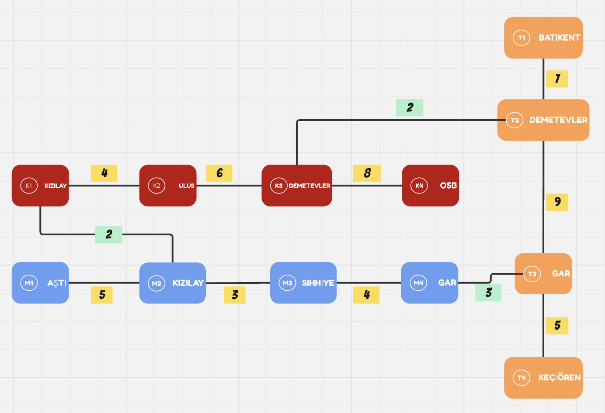

# metro_simulation

### Açıklama:
    Bu proje, BFS (Breadth First Search) ve A* (A-Star) algoritmalarını kullanarak bir metro ağında en kısa rotayı ve an az aktarmalı yolu bulan bir simülasyon uygulamasıdır.
    Kullanıcılar iki istasyon girdisi vererek en verimli güzergahı bulabilirler.

## Kullanılan Teknolojiler ve Kütüphaneler

Bu projede Python dili ve aşağıdaki kütüphaneler kullanılmıştır:

  * `heapq` -> 
  * `collections.deque` -> 
  * `defaultdict` -> 
  * `typing` -> { Dict, List, Set, Tuple, Optional } türleri için ipuçları sağlayarak kodun okunabilirliğini artırır.


## Algoritmaların Çalışma Mantığı 


#### 🔶 BFS (Breadth-First-Search) Algoritması
    *BFS, en az aktarma yapılan güzergahı bulmak için kullanılır.*
    Bu algoritma FIFO (**First In, First Out**) prensibiyle çalışır ve seviyeli bir şekilde tüm istaasyonları tarar.

    *Adımlar:*
    1. Başlangıç istayonu kuyruğa (**queue**) eklenir.
    2. Kuyruğun başındaki istasyon çıkarılır ve komşu istasyonlar kuyruğa eklenir.
    3. Eğer hedeef istayona ulaşılmış ise rota döndürülür.
    4. Kuyruk boşalana kadar bu işlem devam eder.
    
    🟢 Neden `BFS`? *En kısa adım sırasıyla* hedefe ulaşmayı garanti eder.


#### 🔶 A* (A-Star) Algoritması
     *(A*) algoritması en hıclı rotayı bulmak içn kullanılır.*
     BFS' den farklı olarak, her istasyonun tahmini bir maliyetini (heuristic) hesaplar ve düşük maliyetli rotayı seçer.

     *Adımlar:*
     1. Başlangıç düğümü `open list` adlı öncelik kuuyruğuna eklenir.
     2. En düşük *f(n) = g(n) + h(n)* değerine sahip düğüm seçilir.
     3. Eğer hedef istasyon ulaşıldıysa, rota döndürülür.
     4. Komşular keşfedilir ve *heuristic(h(n))* değeri ile maliyet güncellenerek `open list`e eklenir.
     5. Tüm düğümler işlenene kadar devam eder.

     🟢 Neden `A*`? BFS' den daha hızlı çalışabilir, çünkü hedefe yakın olan yolları önceliklendirir. Daha az gereksiz düğüm ziyaret ederek verimli bir hesaplama yapar.


## Örnek Kullanım ve Sonuçlar


*Bağlantıların Görselleştirilmesi*

<p align="center">
  
  Koddaki Node Bağlantılarından Yola Çıkılarak Elde Edilen Graf
</p>


```python
# Senaryo 5: Kızılay'dan Keçiören'e
    print("\n5. Kızılay'dan Keçiören'e")
    rota = metro.en_az_aktarma_bul("K1", "T4")
    if rota:
        print("En az aktarmalı rota:", " -> ".join(i.ad for i in rota))
    
    sonuc = metro.en_hizli_rota_bul("K1", "T4")
    if sonuc:
        rota, sure = sonuc
        print(f"En hızlı rota ({sure} dakika):", " -> ".join(i.ad for i in rota))
```

*Çıktı:*
```
  5. Kızılay'dan Keçiören'e
En az aktarmalı rota: Kızılay -> Ulus -> Demetevler -> Demetevler -> Gar -> Keçiören
En hızlı rota (16 dakika): Kızılay -> Kızılay -> Sıhhiye -> Gar -> Gar -> Keçiören
```

```python
# Senaryo 6: Aşti'den Demetevler'e
    print("\n6. Demetevler'den Aşti' ye")
    rota = metro.en_az_aktarma_bul("T2", "M1")
    if rota:
        print("En az aktarmalı rota:", " -> ".join(i.ad for i in rota))
    
    sonuc = metro.en_hizli_rota_bul("T2", "M1")
    if sonuc:
        rota, sure = sonuc
        print(f"En hızlı rota ({sure} dakika):", " -> ".join(i.ad for i in rota)) 
```

*Çıktı:*
```
  6. Demetevler'den Aşti' ye
En az aktarmalı rota: Demetevler -> Gar -> Gar -> Sıhhiye -> Kızılay -> AŞTİ
En hızlı rota (20 dakika): Demetevler -> Demetevler -> Ulus -> Kızılay -> Kızılay -> AŞTİ
```


## Projeyi Geliştirme Fikirleri

* Farklı metro hatlarını da destekleyen daha kapsamlı bir ağ oluşturularak başlagıç noktası, hedef seçimi ve hesaplama sonuçları görsel bir arayüzle birleştirilebilir.

* Sadece metro ile kalmayarak trafik için de dinamik ağırlıklarla çalışan bir algoritma eklenebilir.


  Bu proje BFS ve A* algoritmalarını kullanmak için harikaydı.